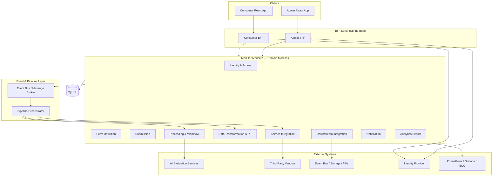
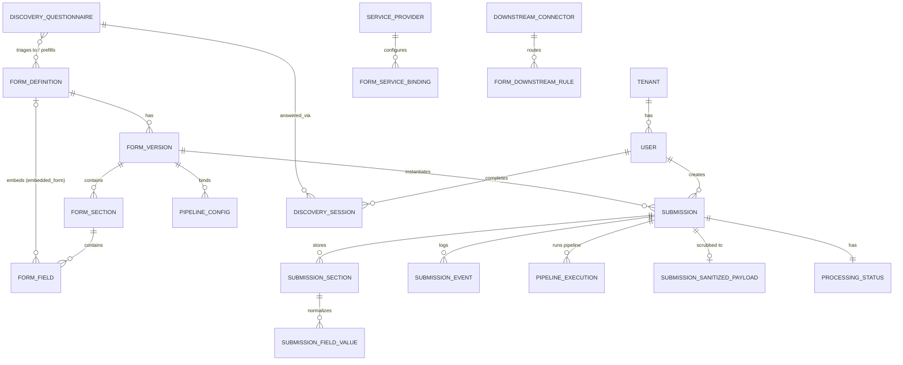
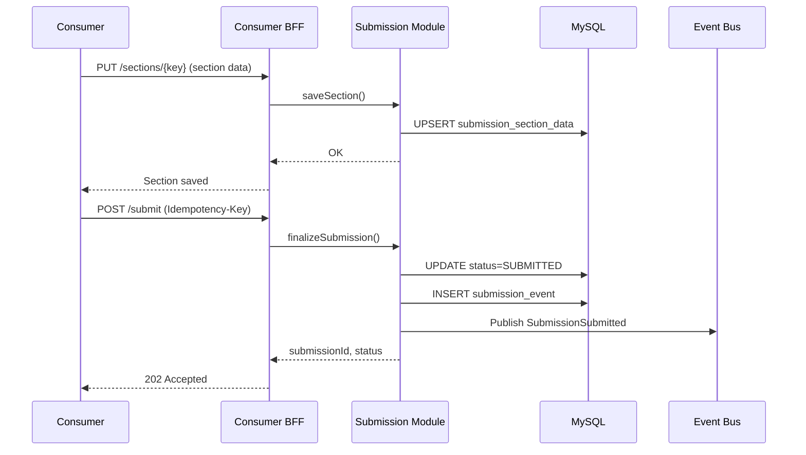
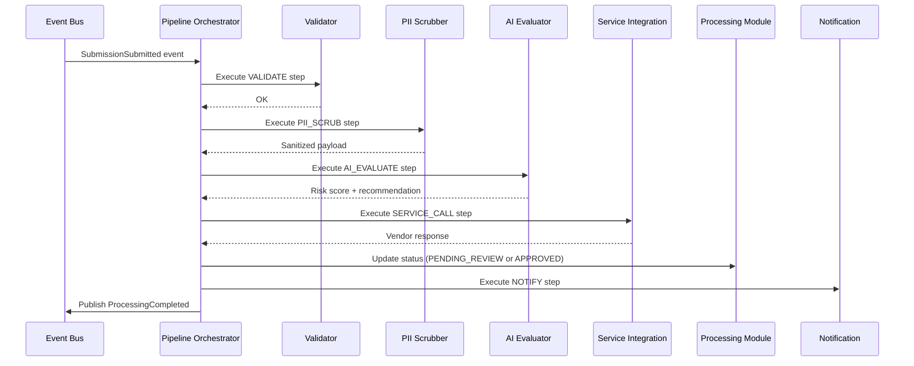
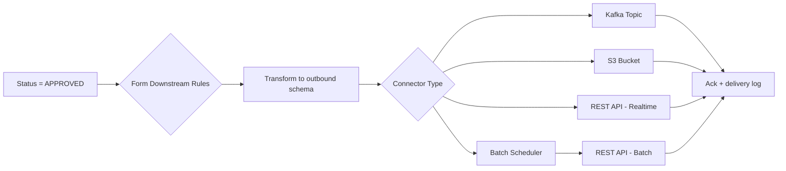
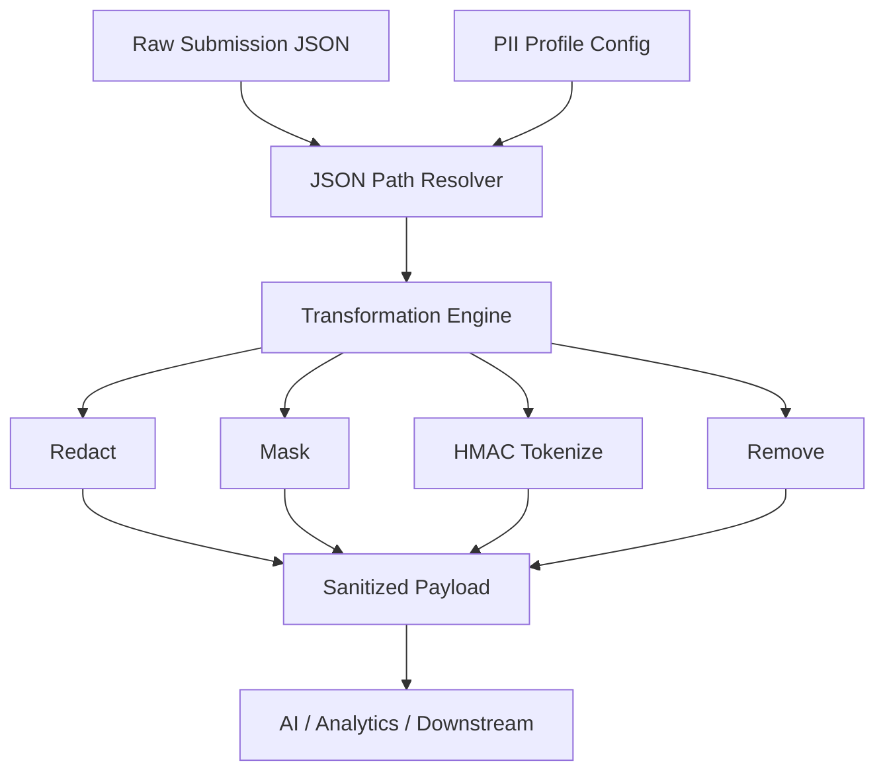
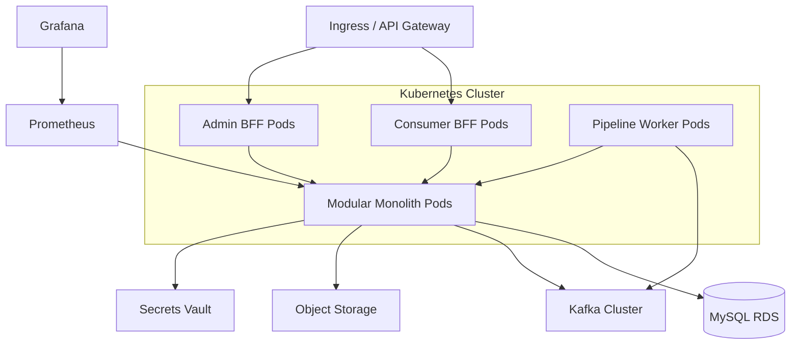

# Banking Support Application — Technical Design Document & Development Guide

This document serves as the authoritative architecture plan and development prompt for a multi-tenant banking support platform with form building, submission, processing, and downstream integration capabilities.

---

## 1. Executive Summary

The platform enables bank staff (admins) to design application forms and end users (consumers) to submit them in a guided, section-wise flow. Submitted applications pass through configurable pipelines: validation, PII scrubbing, AI-assisted evaluation, status management, notifications, and downstream delivery.

**Technology stack:**
- **Frontend:** React 18+, TypeScript, React Router, TanStack Query, Zustand (or Redux Toolkit)
- **Backend:** Spring Boot 3.x, Java 21, modular monolith
- **Database:** MySQL 8.x
- **Messaging:** Apache Kafka (or RabbitMQ) for events
- **Observability:** Micrometer + Prometheus, OpenTelemetry, structured logging (JSON)
- **Auth:** OAuth 2.0 / OpenID Connect (e.g., Keycloak, Auth0, or bank IdP)

**Architectural patterns:**
- Modular monolith (domain-driven modules, clear boundaries)
- Backend-for-Frontend (BFF) — separate BFFs for consumer and admin
- Event-driven processing for async pipelines
- Plugin/adapter pattern for external services and downstream integrations

---

## 2. Overall System Architecture



### 2.1 Layer Responsibilities

| Layer | Responsibility |
|-------|----------------|
| **Consumer React App** | Form discovery, section-wise submission, draft save, status tracking |
| **Admin React App** | Form builder, pipeline config, service bindings, submission review |
| **Consumer BFF** | Aggregates APIs, shapes DTOs for consumer UX, enforces consumer RBAC |
| **Admin BFF** | Aggregates admin workflows, audit views, bulk operations |
| **Domain Modules** | Business logic, persistence, domain events |
| **Pipeline Orchestrator** | Executes configurable step chains per form type |
| **Event Bus** | Decouples submission from processing, enables retries and fan-out |

---

## 3. Backend Module Design (Spring Boot Modular Monolith)

### 3.1 Module Structure

```
banking-forms-platform/
├── app/                          # Bootstrap, config, shared kernel
├── bff-consumer/                 # Consumer BFF controllers & DTOs
├── bff-admin/                    # Admin BFF controllers & DTOs
├── module-identity/              # Users, roles, tenants, sessions
├── module-form-definition/       # Forms, sections, fields, validation rules
├── module-submission/            # Drafts, submissions, attachments
├── module-discovery/             # Discovery questionnaire, triage, pre-population
├── module-processing/            # Workflow states, AI evaluation hooks
├── module-transformation/        # PII scrubbing, field mapping
├── module-service-integration/     # Provider registry, adapters
├── module-downstream/            # Connectors: Kafka, S3, API, disk
├── module-notification/            # Email, SMS, in-app notifications
├── module-analytics/               # Export events, analytics-ready datasets
├── module-observability/           # Metrics, tracing, health checks
└── module-pipeline/                # Pipeline definitions & orchestration
```

Each module exposes:
- **Domain layer:** entities, value objects, domain services
- **Application layer:** use cases, command/query handlers
- **Infrastructure layer:** JPA repositories, adapters, event publishers
- **API layer (internal):** module-facing interfaces (not HTTP — use Spring `@ApplicationModule` or package boundaries)

Modules communicate via:
1. **Synchronous:** internal application service interfaces (in-process)
2. **Asynchronous:** domain events published to the event bus

### 3.2 Module Breakdown

#### `module-identity`
- User registration linkage (via IdP subject ID)
- Roles: `CONSUMER`, `ADMIN`, `REVIEWER`, `SUPER_ADMIN`
- Tenant/org scoping for multi-bank or multi-division deployments
- API key management for machine-to-machine downstream consumers

#### `module-form-definition`
- Form templates (versioned)
- Sections and fields with types: text, number, date, select, file, address, SSN/TIN (masked)
- Validation rules (required, regex, min/max, cross-field)
- Conditional visibility logic (JSON Logic or SpEL)
- Per-form pipeline binding and service integration config references
- **Storage strategy** per form (`JSON_BLOB` | `KEY_VALUE`) — drives how submission data is persisted (see §5.4)
- **Embedded/nested forms** — a field of type `embedded_form` references another published form by `formCode`; the schema is composed (inlined) recursively at read time with cycle + depth guards (see §5.5)

#### `module-submission`
- Draft persistence (section-level checkpoints)
- Final submission with idempotency key
- **Dynamic section storage** via a strategy resolved from the form's `storage_strategy`:
  - `JSON_BLOB` — whole section as one JSON document (flexible, cheap; simple forms)
  - `KEY_VALUE` — one normalized row per field (indexing, column-level encryption, audit; regulated forms)
- File upload metadata (actual blobs in object storage)
- Submission versioning and amendment support
- **Pre-population** — `createDraft` accepts an optional seed payload (`sectionKey -> fieldKey -> value`) persisted through the form's storage strategy without required-field validation (a seeded draft is intentionally partial; validation runs on submit) — see §5.6

#### `module-discovery`
- **Form Discovery Wizard** — a config-driven preliminary questionnaire that triages users to the right core form before a formal application begins (see §5.6)
- `discovery_questionnaire` holds three JSON documents: `schema` (questions, rendered by the same form renderer), `rules` (triage rules), `mappings` (per-target-form pre-population maps)
- `RecommendationEngine` — pure, stateless rule evaluation: each rule's conditions (`EQUALS`, `IN`, `GT`, `EXISTS`, …) are matched against answers; matching rules add weight to a target form and contribute a human-readable rationale; forms are returned ranked by score
- `DiscoverySession` persists the user's answers + top recommendation so the chosen application can be pre-populated
- Emits no HTTP itself; consumed by the consumer BFF

#### `module-processing`
- **Manual review workflow (implemented)** — a `ReviewWorkflow` state machine drives admin decisions on submissions (see §5.7)
- Legal transitions: `SUBMITTED → PENDING_REVIEW` (start review), `PENDING_REVIEW → APPROVED | REJECTED | NEEDS_INFO`, and `NEEDS_INFO → PENDING_REVIEW` (resume). Illegal transitions raise `ReviewException` (HTTP 409)
- `ReviewService` loads the submission (tenant-scoped), applies the transition, persists the new status, and appends an audit event via the shared `SubmissionEventRecorder`
- Reuses `SubmissionStatus` from `module-submission`; the full lifecycle enum also reserves `VALIDATING`/`PROCESSING` for the future automated pipeline
- AI evaluation request/response contract (pluggable `AiEvaluator` interface) — implemented as the pipeline `AI_EVALUATE` step (see §5.8, §9.6); the reviewer sees the advisory recommendation
- Audit trail for every state transition, surfaced as a timeline in the admin portal

#### `module-transformation`
- **PII scrubbing (implemented)** — `PiiScrubber` walks a submission's section data (recursively, including embedded forms) and produces a sanitized copy plus an audit of every transformed field (see §5.8)
- `PiiFieldRegistry` resolves a `PiiStrategy` per field; `DefaultPiiFieldRegistry` classifies by leaf field name (SSN/TIN, account/IBAN/routing, phone, email, DOB, …), leaving names untouched so reviewers can read them
- Strategies: `MASK` (last-4 visible), `HASH` (salted SHA-256 token, correlatable), `REDACT`, `REMOVE`, `NONE`
- Output: sanitized payload for AI, analytics, and downstream — never mutates the source of record

#### `module-service-integration`
- Provider catalog (credit bureau, identity verification, tax residency API)
- Adapter interface: `ServiceAdapter.execute(context, config) → ServiceResult`
- Per-form overrides: which provider, credentials profile, timeout, retry policy
- Circuit breaker (Resilience4j) per provider

#### `module-downstream`
- Connector types: `EVENT_BUS`, `OBJECT_STORAGE`, `FILE_SYSTEM`, `REST_API_BATCH`, `REST_API_REALTIME`
- Delivery guarantees: at-least-once with idempotent consumer design
- Per-form routing rules (approved only, include attachments, schema version)

#### `module-notification`
- **Multi-channel customer notifications (implemented)** — event-driven on submission lifecycle transitions (submit + review decisions), with a configurable, data-driven provider registry mirroring form-import (see §5.11)
- `NotificationChannel` SPI + `notification_provider` registry + `NotificationChannelRouter` (priority-based selection per logical channel); durable outbox (`notification_message`) drained by an async `@Scheduled` dispatcher with retries, backoff, and dead-lettering
- In-JVM default `log-email` (zero-setup, demoable) and `smtp-email` (JavaMailSender) email channels; external `whatsapp-cloud` (Meta Cloud API) channel lives in `module-service-integration`
- `RecipientResolver` derives email/phone/consent/locale from submission data; `TemplateRenderer` renders per (event, channel, locale) templates with `{{placeholder}}` substitution and built-in fallbacks
- Advisory + fail-safe: notification errors never affect the submission/review flow; every attempt is logged to the submission timeline (`NOTIFICATION_QUEUED/SENT/DELIVERED/FAILED/SKIPPED`)
- Delivery-status webhook endpoint (`/api/webhooks/notifications/{provider}`) updates messages to `DELIVERED`; consent enforcement gated by `notifications.require-consent`

#### `module-pipeline`
- **Automated processing pipeline (implemented)** — `SubmissionPipelineService` runs on submit: `VALIDATE → PII_SCRUB → DOWNSTREAM`, advancing the submission `SUBMITTED → VALIDATING → PROCESSING → PENDING_REVIEW` and recording each step in the submission timeline (see §5.8)
- Persists a per-submission `PipelineExecution` (status/step/error) and the `SanitizedPayload` produced by the PII scrub
- Failure-tolerant: a failed run is captured, the submission reverts to `SUBMITTED`, and the submit request still succeeds
- Target/future pipeline DSL (config-driven steps, stored in `pipeline_config`):

```json
{
  "formType": "LOAN_APPROVAL",
  "steps": [
    { "type": "VALIDATE", "config": {} },
    { "type": "PII_SCRUB", "config": { "profile": "loan-analytics" } },
    { "type": "AI_EVALUATE", "config": { "evaluatorId": "risk-scorer-v1" } },
    { "type": "SERVICE_CALL", "config": { "provider": "credit-bureau", "adapter": "experian" } },
    { "type": "DOWNSTREAM", "config": { "connector": "s3-archival" } },
    { "type": "NOTIFY", "config": { "template": "loan-submitted" } }
  ]
}
```

- Implemented: `AI_EVALUATE` step (pluggable `AiEvaluator`, advisory + fail-safe — see §5.8, §9.6)
- Planned: config-driven step executor registry, service calls, dead-letter queue for failed steps

#### `module-analytics`
- Publishes anonymized events to analytics topics
- Batch export jobs (Parquet/CSV) to data lake bucket
- Schema registry for analytics event contracts

#### `bff-consumer` & `bff-admin`
- Thin controllers — no business logic
- DTO aggregation (e.g., form + user draft + validation errors in one response)
- Rate limiting, CORS, CSRF (admin), request validation
- Separate security filter chains per BFF

---

## 4. Frontend Component Design (React)

### 4.1 Application Split

```
frontend/
├── apps/
│   ├── consumer-portal/       # User-facing submission app
│   └── admin-portal/          # Form builder & operations
├── packages/
│   ├── ui/                    # Shared design system
│   ├── form-renderer/         # Dynamic form rendering engine
│   ├── form-builder/          # Drag-and-drop admin builder
│   ├── api-client/            # Generated/typed API clients
│   └── auth/                  # OIDC hooks & guards
```

### 4.2 Consumer Portal Components

| Component | Purpose |
|-----------|---------|
| `FormCatalog` | Browse available application types |
| `SubmissionWizard` | Multi-section stepper with progress persistence |
| `SectionRenderer` | Renders fields from form schema; client-side validation |
| `DraftAutoSave` | Debounced save to backend every N seconds |
| `FileUploadField` | Chunked upload with virus-scan status polling |
| `SubmissionStatusTracker` | Timeline of processing states |
| `NotificationsCenter` | In-app notification inbox |

**Section-wise flow:**
1. Load form schema + existing draft
2. Validate current section before "Next"
3. Save section payload independently
4. On final section → review summary → submit with idempotency key

### 4.3 Admin Portal Components

| Component | Purpose |
|-----------|---------|
| `FormBuilderCanvas` | Drag-and-drop section/field layout |
| `FieldConfigurator` | Type, label, validation, conditional rules |
| `PipelineConfigurator` | Visual or JSON editor for processing pipeline |
| `PIIProfileEditor` | Map fields to scrubbing strategies |
| `ServiceBindingPanel` | Attach providers to form types |
| `DownstreamRoutingEditor` | Configure connectors and triggers |
| `SubmissionReviewQueue` | Filter, assign, approve/reject |
| `AuditLogViewer` | Per-submission event history |
| `AnalyticsDashboardEmbed` | Grafana/Metabase iframe or native charts |

### 4.4 Form Builder Component (Detailed)

**Capabilities:**
- Create form metadata (name, code, version, category)
- Define sections (ordered, optional/required)
- Field palette: primitives + banking-specific (TIN, account number, currency)
- Validation rule builder (UI mapping to JSON schema / custom rules)
- Preview mode (consumer renderer sandbox)
- Publish workflow: `DRAFT → PUBLISHED → DEPRECATED`
- Version immutability: published forms cannot be edited; clone to new version

### 4.5 Form Submission Component (Detailed)

**State management:**

```typescript
interface SubmissionState {
  submissionId: string | null;
  formVersionId: string;
  currentSectionIndex: number;
  sectionData: Record<string, Record<string, unknown>>;
  validationErrors: Record<string, FieldError[]>;
  status: 'editing' | 'submitting' | 'submitted';
}
```

**Key behaviors:**
- Resume incomplete drafts on login
- Optimistic UI with server reconciliation
- Offline queue (optional PWA) for section saves
- Accessibility: WCAG 2.1 AA, keyboard navigation across sections

---

## 5. Database Schema Design (MySQL)

### 5.1 Entity Relationship Overview



### 5.2 Core Tables

```sql
-- Multi-tenancy
CREATE TABLE tenant (
    id            BINARY(16) PRIMARY KEY,
    code          VARCHAR(64) NOT NULL UNIQUE,
    name          VARCHAR(255) NOT NULL,
    created_at    TIMESTAMP NOT NULL DEFAULT CURRENT_TIMESTAMP
);

-- Users (linked to IdP)
CREATE TABLE app_user (
    id              BINARY(16) PRIMARY KEY,
    tenant_id       BINARY(16) NOT NULL,
    idp_subject     VARCHAR(255) NOT NULL,
    email           VARCHAR(255) NOT NULL,
    display_name    VARCHAR(255),
    status          ENUM('ACTIVE','SUSPENDED') NOT NULL DEFAULT 'ACTIVE',
    created_at      TIMESTAMP NOT NULL DEFAULT CURRENT_TIMESTAMP,
    UNIQUE KEY uk_tenant_idp (tenant_id, idp_subject),
    FOREIGN KEY (tenant_id) REFERENCES tenant(id)
);

CREATE TABLE user_role (
    user_id     BINARY(16) NOT NULL,
    role        ENUM('CONSUMER','ADMIN','REVIEWER','SUPER_ADMIN') NOT NULL,
    PRIMARY KEY (user_id, role),
    FOREIGN KEY (user_id) REFERENCES app_user(id)
);

-- Form definition
CREATE TABLE form_definition (
    id              BINARY(16) PRIMARY KEY,
    tenant_id       BINARY(16) NOT NULL,
    code            VARCHAR(64) NOT NULL,
    name            VARCHAR(255) NOT NULL,
    category        VARCHAR(64),
    storage_strategy ENUM('JSON_BLOB','KEY_VALUE') NOT NULL DEFAULT 'JSON_BLOB',
    created_at      TIMESTAMP NOT NULL DEFAULT CURRENT_TIMESTAMP,
    UNIQUE KEY uk_tenant_code (tenant_id, code),
    FOREIGN KEY (tenant_id) REFERENCES tenant(id)
);

CREATE TABLE form_version (
    id                  BINARY(16) PRIMARY KEY,
    form_definition_id  BINARY(16) NOT NULL,
    version_number      INT NOT NULL,
    status              ENUM('DRAFT','PUBLISHED','DEPRECATED') NOT NULL,
    schema_json         JSON NOT NULL,
    published_at        TIMESTAMP NULL,
    created_by          BINARY(16) NOT NULL,
    FOREIGN KEY (form_definition_id) REFERENCES form_definition(id),
    UNIQUE KEY uk_form_version (form_definition_id, version_number)
);

-- Submissions
CREATE TABLE submission (
    id                  BINARY(16) PRIMARY KEY,
    tenant_id           BINARY(16) NOT NULL,
    form_version_id     BINARY(16) NOT NULL,
    user_id             BINARY(16) NOT NULL,
    status              ENUM('DRAFT','SUBMITTED','VALIDATING','PROCESSING',
                            'PENDING_REVIEW','APPROVED','REJECTED','NEEDS_INFO') NOT NULL,
    idempotency_key     VARCHAR(64),
    submitted_at        TIMESTAMP NULL,
    created_at          TIMESTAMP NOT NULL DEFAULT CURRENT_TIMESTAMP,
    updated_at          TIMESTAMP NOT NULL DEFAULT CURRENT_TIMESTAMP ON UPDATE CURRENT_TIMESTAMP,
    FOREIGN KEY (form_version_id) REFERENCES form_version(id),
    FOREIGN KEY (user_id) REFERENCES app_user(id),
    UNIQUE KEY uk_idempotency (tenant_id, idempotency_key)
);

-- Section header. For JSON_BLOB forms the payload lives in section_data_json;
-- for KEY_VALUE forms this is the parent of submission_field_value and section_data_json is NULL.
CREATE TABLE submission_section (
    id                  BINARY(16) PRIMARY KEY,
    submission_id       BINARY(16) NOT NULL,
    section_key         VARCHAR(100) NOT NULL,
    section_data_json   LONGTEXT NULL,
    updated_at          TIMESTAMP NOT NULL DEFAULT CURRENT_TIMESTAMP ON UPDATE CURRENT_TIMESTAMP,
    FOREIGN KEY (submission_id) REFERENCES submission(id),
    UNIQUE KEY uq_submission_section (submission_id, section_key)
);

-- Normalized per-field storage for KEY_VALUE forms.
CREATE TABLE submission_field_value (
    id              BINARY(16) PRIMARY KEY,
    section_id      BINARY(16) NOT NULL,
    field_key       VARCHAR(255) NOT NULL,
    field_value     TEXT NULL,                     -- stringified data representation
    is_encrypted    BOOLEAN NOT NULL DEFAULT FALSE, -- column-level encryption for PII fields
    FOREIGN KEY (section_id) REFERENCES submission_section(id),
    UNIQUE KEY uq_section_field (section_id, field_key),
    INDEX idx_field_lookup (field_key, field_value(50))  -- optimized key-value queries
);

CREATE TABLE submission_event (
    id              BIGINT AUTO_INCREMENT PRIMARY KEY,
    submission_id   BINARY(16) NOT NULL,
    event_type      VARCHAR(64) NOT NULL,
    payload_json    JSON,
    actor_id        BINARY(16),
    created_at      TIMESTAMP NOT NULL DEFAULT CURRENT_TIMESTAMP,
    FOREIGN KEY (submission_id) REFERENCES submission(id),
    INDEX idx_submission_created (submission_id, created_at)
);

-- Pipeline & processing
CREATE TABLE pipeline_config (
    id                  BINARY(16) PRIMARY KEY,
    form_version_id     BINARY(16) NOT NULL,
    config_json         JSON NOT NULL,
    version             INT NOT NULL DEFAULT 1,
    active              BOOLEAN NOT NULL DEFAULT TRUE,
    FOREIGN KEY (form_version_id) REFERENCES form_version(id)
);

CREATE TABLE pipeline_execution (
    id                  BINARY(16) PRIMARY KEY,
    submission_id       BINARY(16) NOT NULL,
    pipeline_config_id  BINARY(16) NOT NULL,
    status              ENUM('RUNNING','COMPLETED','FAILED','COMPENSATING') NOT NULL,
    current_step        INT NOT NULL DEFAULT 0,
    started_at          TIMESTAMP NOT NULL,
    completed_at        TIMESTAMP NULL,
    error_details       JSON,
    FOREIGN KEY (submission_id) REFERENCES submission(id)
);

-- Service integration
CREATE TABLE service_provider (
    id              BINARY(16) PRIMARY KEY,
    tenant_id       BINARY(16) NOT NULL,
    code            VARCHAR(64) NOT NULL,
    adapter_type    VARCHAR(64) NOT NULL,
    config_json     JSON NOT NULL,
    enabled         BOOLEAN NOT NULL DEFAULT TRUE,
    UNIQUE KEY uk_tenant_provider (tenant_id, code)
);

CREATE TABLE form_service_binding (
    id                  BINARY(16) PRIMARY KEY,
    form_version_id     BINARY(16) NOT NULL,
    service_provider_id BINARY(16) NOT NULL,
    step_key            VARCHAR(64) NOT NULL,
    override_config     JSON,
    FOREIGN KEY (form_version_id) REFERENCES form_version(id),
    FOREIGN KEY (service_provider_id) REFERENCES service_provider(id)
);

-- PII & transformation
CREATE TABLE pii_profile (
    id              BINARY(16) PRIMARY KEY,
    tenant_id       BINARY(16) NOT NULL,
    code            VARCHAR(64) NOT NULL,
    rules_json      JSON NOT NULL,
    UNIQUE KEY uk_tenant_pii (tenant_id, code)
);

-- Downstream
CREATE TABLE downstream_connector (
    id              BINARY(16) PRIMARY KEY,
    tenant_id       BINARY(16) NOT NULL,
    code            VARCHAR(64) NOT NULL,
    connector_type  ENUM('EVENT_BUS','OBJECT_STORAGE','FILE_SYSTEM',
                         'REST_API_BATCH','REST_API_REALTIME') NOT NULL,
    config_json     JSON NOT NULL,
    enabled         BOOLEAN NOT NULL DEFAULT TRUE
);

CREATE TABLE form_downstream_rule (
    id                      BINARY(16) PRIMARY KEY,
    form_version_id         BINARY(16) NOT NULL,
    downstream_connector_id BINARY(16) NOT NULL,
    trigger_on              ENUM('APPROVED','SUBMITTED','STATUS_CHANGE') NOT NULL,
    payload_template_json   JSON,
    FOREIGN KEY (form_version_id) REFERENCES form_version(id),
    FOREIGN KEY (downstream_connector_id) REFERENCES downstream_connector(id)
);

-- Attachments
CREATE TABLE submission_attachment (
    id              BINARY(16) PRIMARY KEY,
    submission_id   BINARY(16) NOT NULL,
    field_key       VARCHAR(64) NOT NULL,
    storage_key     VARCHAR(512) NOT NULL,
    file_name       VARCHAR(255) NOT NULL,
    mime_type       VARCHAR(128),
    size_bytes      BIGINT,
    scan_status     ENUM('PENDING','CLEAN','INFECTED') NOT NULL DEFAULT 'PENDING',
    created_at      TIMESTAMP NOT NULL DEFAULT CURRENT_TIMESTAMP,
    FOREIGN KEY (submission_id) REFERENCES submission(id)
);
```

### 5.3 Indexing & Partitioning Notes
- Partition `submission_event` by month for high volume
- Index `(tenant_id, status, submitted_at)` on `submission` for admin queues
- Use `BINARY(16)` UUIDs for primary keys (compact, index-friendly)
- Sensitive fields in `submission_field_value` — use the `is_encrypted` flag + column-level encryption for regulated fields

### 5.4 Dynamic Submission Storage Strategy

Storage is selected **per form** via `form_definition.storage_strategy`, keeping simple forms flexible while regulated forms gain normalized, queryable, encryptable field storage. The choice is transparent to the API and UI — only the persistence layer differs.

| Strategy | Persistence | Best for |
|----------|-------------|----------|
| `JSON_BLOB` (default) | One JSON document per section in `submission_section.section_data_json` | Simple, low-regulation forms; rapid schema iteration |
| `KEY_VALUE` | One row per field in `submission_field_value` (section row is the parent header) | Heavily regulated forms needing per-field indexing, column-level PII encryption, and audit |

**Resolution flow (`module-submission`):**

```
saveSection() / loadAllSections()
        │
        ▼
SectionStorageRouter.resolve(form.storageStrategy)
        │
        ├── JSON_BLOB → JsonBlobSectionStorage  (submission_section.section_data_json)
        └── KEY_VALUE → KeyValueSectionStorage  (submission_section + submission_field_value)
```

- `SectionStorageStrategy` is a Spring-managed interface; each implementation self-registers by the `StorageStrategy` it handles, so adding a new backend (e.g. encrypted document store) is additive.
- `KEY_VALUE` persists values as their string representation and replaces a section's field rows atomically on each save.
- `is_encrypted` is the integration point for the `module-transformation` PII registry (SSN/TIN/account fields).
- **Trade-off:** `KEY_VALUE` loses native JSON typing (values are strings) and costs more rows/joins; choose it only when indexing/encryption/audit justify it.

### 5.5 Embedded / Nested Form Composition

A published form can be **embedded directly into another form's field layout**, so reusable building blocks (address, applicant profile, KYC block) are defined once and composed into many host forms. This is a field-level embed, not a copy — the embedded form keeps its own definition, versioning, and storage strategy.

**Authoring** — a field references another form by code:

```json
{
  "key": "homeAddress",
  "type": "embedded_form",
  "label": "Home Address",
  "formCode": "ADDRESS_DETAILS",
  "required": true
}
```

**Schema composition (`module-form-definition`)** — `FormSchemaComposer` walks the host schema and, for every `embedded_form` field, resolves the referenced form's **latest published** version (same tenant) and inlines its sections under an `embeddedForm` node:

```
FormQueryService.findPublished*()
        │
        ▼
FormSchemaComposer.compose(tenantId, schema)   // recursive
        │  for each field.type == "embedded_form":
        │     resolve latest PUBLISHED version by formCode (same tenant)
        │     recurse into its schema, then inline as field.embeddedForm { code, name, sections }
        ▼
composed schema  →  PublishedFormView.schema()  →  consumer/admin APIs
```

- **Guards:** cycle detection (a `formCode` already on the resolution path is rejected) and a max nesting depth (`5`). Unresolvable references are marked `embeddedUnavailable` rather than breaking the whole form.
- The composed schema is what the API returns, so the frontend renders embedded forms without any extra round-trips.

**Recursive validation (`module-submission`)** — `SectionValidator` treats an `embedded_form` value as a nested `{ sectionKey: { fieldKey: value } }` map and validates it against the inlined `embeddedForm.sections` recursively. Error keys are dot-namespaced (e.g. `homeAddress.address.line1`) so nested violations stay distinguishable and map back to the exact input in the UI.

**Recursive storage** — the nested value flows through the same `SectionStorageStrategy` as the host section:

| Host strategy | How nested embedded data is stored |
|---------------|-------------------------------------|
| `JSON_BLOB` | Native — the nested object is part of the section's JSON document |
| `KEY_VALUE` | Flattened to dot-delimited leaf keys (`homeAddress.address.line1`) so each leaf stays an individually indexable/encryptable row; reconstructed (unflattened) on load |

> **Constraint:** because `KEY_VALUE` uses `.` as the path separator for flattening, field/section keys must not contain a dot.

**Data shape example** (host `residence` section containing an embedded `ADDRESS_DETAILS`):

```json
{
  "homeAddress": {
    "address": { "line1": "1 King St", "city": "Sydney", "postcode": "2000" }
  }
}
```

### 5.6 Form Discovery Wizard (Triage + Pre-population)

Before a formal application begins, the **Form Discovery Wizard** runs a brief dynamic questionnaire, triages the answers to recommend the ideal core form, and carries those preliminary answers into the real application so users never enter the same data twice. It is entirely config-driven via `discovery_questionnaire` (no code changes to add a questionnaire).

**Three config documents per questionnaire:**

| Document | Purpose |
|----------|---------|
| `schema_json` | The questions, in the same sections/fields format as core forms — so the **same form renderer** presents them |
| `rules_json` | Triage rules: `[{ targetFormCode, weight, rationale, conditions:[{ questionKey, operator, value }] }]` |
| `mappings_json` | Pre-population maps: `{ "<targetFormCode>": [{ questionKey, targetSection, targetField }] }` |

**End-to-end flow:**

```
1. GET  /discovery/{code}                → questionnaire schema (rendered dynamically)
2. POST /discovery/{code}/evaluate       → RecommendationEngine.rank(rules, answers)
        │                                   persists DiscoverySession(answers, topRecommendation)
        ▼
   { sessionId, recommendations:[{ formCode, formName, score, recommended, reasons[] }] }
3. POST /submissions { formCode, discoverySessionId }
        │  BFF → DiscoveryService.buildPrefill(sessionId, formCode)  // answers ↦ section/field values
        ▼  SubmissionService.createDraft(..., prefill)  // seeded via the form's storage strategy
   draft already contains the mapped answers → user just reviews & completes
```

**Recommendation engine** — stateless and unit-testable. For each rule, all conditions must match (`EQUALS`, `NOT_EQUALS`, `IN`, `GT/GTE/LT/LTE`, `EXISTS/NOT_EXISTS`; numeric comparisons parse both sides, fail closed on non-numeric). Matching rules accumulate `weight` per target form and append their `rationale`; forms are returned sorted by score, the top one flagged `recommended`.

**Pre-population** — `buildPrefill` reads the persisted session answers and the questionnaire's mappings for the chosen form, producing a `sectionKey -> fieldKey -> value` payload. This flows through the **same storage strategy** as any section data (native for `JSON_BLOB`, flattened rows for `KEY_VALUE`), so pre-population works identically for both. Seeded drafts skip required-field validation (they are intentionally partial); validation is enforced only on final submit. Stale/invalid session references degrade gracefully to an empty prefill so starting an application never fails.

**Trade-off / boundary:** triage rules and mappings are declarative config, not code — powerful for iteration, but they trust the referenced `formCode`/section/field keys to exist; unmatched or missing references simply contribute nothing rather than erroring.

---

### 5.7 Processing & Review Workflow (State Machine + Audit Timeline)

Once a consumer submits, the application enters a **manual review workflow** owned by `module-processing`. Admins move a submission through a small, explicit state machine, and every transition is appended to an immutable audit timeline.

**State machine (`ReviewWorkflow`):**

```
                ┌──────────── request-info ─────────────┐
                ▼                                        │
  SUBMITTED ──start──▶ PENDING_REVIEW ──approve──▶ APPROVED (terminal)
      ▲                     │  │
      │                     │  └──────── reject ───────▶ REJECTED (terminal)
   (n/a)                    │
                           requestInfo
                            ▼
                        NEEDS_INFO ──start (resume)──▶ PENDING_REVIEW
```

| Action | Allowed from | Result | Event type |
|--------|--------------|--------|------------|
| `start` | `SUBMITTED`, `NEEDS_INFO` | `PENDING_REVIEW` | `REVIEW_STARTED` |
| `approve` | `PENDING_REVIEW` | `APPROVED` | `APPROVED` |
| `reject` | `PENDING_REVIEW` | `REJECTED` | `REJECTED` |
| `request-info` | `PENDING_REVIEW` | `NEEDS_INFO` | `INFO_REQUESTED` |

Any action attempted from a status not in its *allowed-from* set raises `ReviewException`, mapped to **HTTP 409 Conflict** by the admin BFF — the state machine is the single source of truth for legality.

**Audit timeline (`submission_event`).** A shared `SubmissionEventRecorder` (in `module-submission`) writes an append-only row per lifecycle change: the initial `SUBMITTED` event on submit, then one row per review action. `payload_json` carries `{ from, to, note? }`; `actor_id` records who acted. The admin submission-detail endpoint returns the ordered timeline alongside the form data, and the admin portal renders it as a vertical activity feed with optional reviewer notes.

**Module boundaries.**
- `module-submission` owns the `Submission` entity (status + transition methods), the `submission_event` store, and the shared recorder.
- `module-processing` owns the workflow *policy* (`ReviewWorkflow`) and orchestration (`ReviewService`), depending on `module-submission` — it never re-implements persistence.
- `bff-admin` exposes the actions (`AdminReviewController`) and composes the timeline into the detail response (`AdminSubmissionsController`).

**Trade-offs.** Transition legality lives in code (not config) because a regulated review lifecycle changes rarely and benefits from compile-time exhaustiveness. Actor identity is currently a dev header (`X-Dev-User-Id`) pending auth; the timeline already persists `actor_id` so wiring real reviewer identity later is a header-to-JWT swap with no schema change.

---

### 5.8 Automated Processing Pipeline (Validate → PII Scrub → AI Evaluate → Downstream)

When a consumer submits, an **automated pipeline** runs before the application reaches a human reviewer. It advances the submission through the transient `VALIDATING`/`PROCESSING` states, produces a PII-sanitized copy for downstream consumers, runs an **advisory AI risk evaluation** on that sanitized copy, and records every step in the same audit timeline used by manual review.

**Flow (`SubmissionPipelineService.process`, one transaction):**

```
POST /submissions/{id}/submit
   │  SubmissionService.submit()                     → status SUBMITTED, event SUBMITTED (tx commits)
   ▼  SubmissionPipelineService.process()            (new tx; never throws)
   ├─ PIPELINE_STARTED
   ├─ 1. VALIDATE     status→VALIDATING  re-run SectionValidator over stored data   → event VALIDATED
   ├─ 2. PII_SCRUB    status→PROCESSING  PiiScrubber → persist SanitizedPayload      → event PII_SCRUBBED
   ├─ 3. AI_EVALUATE  AiEvaluatorRouter scores the sanitized payload (fail-safe)     → event AI_EVALUATED
   ├─ 4. DOWNSTREAM   (stub) dispatch sanitized payload to analytics stream          → event DOWNSTREAM_DISPATCHED
   └─ COMPLETE        status→PENDING_REVIEW                                          → event PIPELINE_COMPLETED
```

The consumer submit endpoint returns the **post-pipeline** status (typically `PENDING_REVIEW`), then hands off to the manual review workflow (§5.7). Because the pipeline lands the submission in `PENDING_REVIEW`, admins can approve/reject/request-info directly.

**PII scrubbing.** `PiiScrubber` (`module-transformation`) recursively walks the section map (including nested embedded-form data), applies the `PiiFieldRegistry`'s strategy per field, and returns a sanitized copy plus a `fieldPath → strategy` audit. Strategies: `MASK` (last-4), `HASH` (salted SHA-256, correlatable), `REDACT`, `REMOVE`, `NONE`. The result is stored in `submission_sanitized_payload` (one row per submission) — the raw source of record is never altered. Admins can inspect the run and the sanitized payload via `GET /submissions/{id}/pipeline`.

**AI evaluation (advisory).** The `AI_EVALUATE` step runs on the **sanitized** payload only (PII always scrubbed first) and produces a risk score `[0,1]` + advisory recommendation (`APPROVE`/`REVIEW`/`REJECT`) + explainability `signals`, persisted to `submission_ai_evaluation` (one row per submission) and surfaced in the pipeline report + timeline (`AI_EVALUATED`). It is a **pluggable seam** — `AiEvaluator` implementations are Spring beans; `AiEvaluatorRouter` selects the active one via `pipeline.ai.evaluator` (default `heuristic`) and can disable the step entirely (`pipeline.ai.enabled=false`). The default `HeuristicAiEvaluator` (`module-pipeline`) is deterministic and dependency-free (completeness / high-value amount / missing-contact / risk-keyword signals); an optional `OllamaAiEvaluator` (`module-service-integration`) scores via a local Ollama text model. **AI never auto-decides** — the recommendation only assists the human reviewer, and the step is fail-safe (any evaluator error/timeout degrades to `REVIEW` and never fails the submission).

**Persistence & audit.** Overall run status/step/error is tracked in `pipeline_execution` (`RUNNING`/`COMPLETED`/`FAILED`); the per-step narrative lives in `submission_event` (actor = system UUID `0…0`), so both automated and manual actions share one chronological timeline in the admin UI.

**Failure handling.** The pipeline **never fails the submit request**: any step exception is caught, the run is marked `FAILED` with `error_details`, a `PIPELINE_FAILED` event is recorded, and the submission is reverted to `SUBMITTED` (so an admin can still `start` a manual review). Since validation already ran at submit time, the VALIDATE step is defense-in-depth and rarely fails.

**Trade-offs / boundaries.**
- The pipeline currently runs **synchronously** in the submit request (no message broker yet). The `outbox_event` table and a future `@TransactionalEventListener`/broker would move this off the request path; the step contract and audit events stay the same. The AI step's synchronous timeout budget is bounded by the evaluator (the default heuristic is instant; the Ollama evaluator has its own timeout and fails safe).
- Steps are **hard-coded** (`VALIDATE, PII_SCRUB, AI_EVALUATE, DOWNSTREAM`) rather than driven by `pipeline_config`; `PipelineStepType` still enumerates the fuller catalog (SERVICE_CALL, NOTIFY) for that evolution.
- `DOWNSTREAM` is a stub (records an event) — real connectors live in `module-downstream`.

---

### 5.9 Draft Save & Resume (Multi-Section Progress)

Long applications span multiple sections and are rarely completed in one sitting. The platform therefore treats an in-progress `DRAFT` as **server-side state**: each page navigation persists what has been entered, and returning to the application restores both the data and the exact page the applicant left off on — no reliance on the browser.

**Partial (draft) saves.** `SubmissionService.saveSection` is deliberately lenient for drafts: it verifies only that the section exists in the schema and then persists the values through the form's storage strategy. **Required-field validation is *not* enforced here** — a half-filled section is a legitimate draft state. Completeness is enforced once, at `submit` (`validateAllSections`). This mirrors how discovery pre-population seeds partial drafts (§5.6).

**Resume position.** The `submission.current_section_key` column (migration `V9`) records the section the applicant should return to. Every section save also stamps a `resumeSectionKey` (the page the wizard is navigating to), and `GET /submissions/{id}` returns it so the client lands on the right step.

**End-to-end flow:**

```
PUT /submissions/{id}/sections/{sectionKey}   { data, resumeSectionKey }
   │  saveSection(): section-exists check → persist via storage strategy (partial OK)
   ▼  submission.updateCurrentSection(resumeSectionKey)     // remember where to resume
   204 No Content

… user closes the tab, returns later …

GET /submissions/{id}
   ▼  { status, currentSectionKey, sectionData }            // data + position restored
   consumer wizard jumps to currentSectionKey; submit validates all sections and,
   if incomplete, sends the user to the first section with missing required fields
```

**Module boundaries.**
- `module-submission` owns the `current_section_key` field on `Submission` (`updateCurrentSection`) and the partial-save policy; `SectionValidator.sectionExists` gates unknown sections without requiring completeness.
- `bff-consumer` (`ConsumerSubmissionsController`) accepts an optional `resumeSectionKey` on save and returns `currentSectionKey` on fetch.
- The consumer wizard (`SubmissionWizardPage`) saves on both *next* and *back*, restores the position once on load, and performs a client-side completeness sweep before submit for a clean UX.

**Trade-offs / boundaries.**
- Draft data is stored **unencrypted-at-field-level for `JSON_BLOB` forms** just like final data; regulated forms use `KEY_VALUE` where field-level encryption applies equally to drafts.
- Progress is a single "furthest/last section" pointer, not a full per-field autosave journal — saves happen on page transitions, not on every keystroke. Continuous autosave (debounced) is a straightforward future enhancement using the same endpoint.
- Because required validation is deferred to submit, drafts can contain incomplete/technically-invalid sections by design; downstream code must treat `DRAFT` data as provisional.

---

### 5.10 Form Import (Multi-Source, Configurable Providers, Human-in-the-Loop)

Authoring a form by hand is slow when the bank already has the form as a PDF, spreadsheet, web page, or scanned image. The **Form Import** pipeline (`module-form-import`) ingests such an artifact, extracts a candidate schema, and hands it to an admin to review and accept — at which point a normal `DRAFT` form is created in `module-form-definition`. **Extraction output is always a proposal; nothing is published automatically.**

**Design goals**
- Support many source types (PDF, CSV, XLS/XLSX, HTML, URL, image) behind one stable contract.
- Let ops add/replace/tune extractors — including AI/vision — **without code changes**, driven by database configuration.
- Keep AI *assistive*: a human reviews and edits before anything becomes a form.

**Provider SPI (`spi/`).** Extraction is a single interface so every source type is handled uniformly:

```java
public interface FormExtractor {
    String code();                                             // stable provider id, e.g. "pdfbox", "ollama-vision"
    ExtractedForm extract(FormImportSource source, ProviderConfig config);
}
```
- `FormImportSource` — neutral input (`sourceType`, `content` bytes, `url`, `fileName`, `contentType`).
- `ProviderConfig` — typed accessors over the provider's `config_json`; `secret(key)` resolves secrets from environment variables via a `secretRef` (so API keys are never stored in the DB).
- `SourceTypes` — canonical tokens (`PDF`, `CSV`, `SPREADSHEET`, `HTML`, `IMAGE`).
- `ExtractedForm` / `ExtractedField` / `FieldKind` — neutral extraction result, independent of any provider or the form-definition schema.

**Configurable provider registry.** The `form_import_provider` table (migration `V11`) is the source of truth for *which extractor handles what*:

| Column | Meaning |
|--------|---------|
| `code` | matches a `FormExtractor.code()` bean |
| `source_type` | which `SourceTypes` token this provider serves |
| `enabled` | on/off without redeploy |
| `priority` | lower wins when several providers serve one source type |
| `config_json` | provider-specific config (endpoint, model, prompt, timeouts, `secretRef`, …) |

Seeded providers: `pdfbox`, `csv`, `poi-spreadsheet`, `jsoup-html` (enabled); `ollama-vision`, `llm-vision` (disabled by default). Admins manage all of this from the **Settings → Import Providers** page (`GET/PUT /api/admin/v1/form-import-providers`).

**Routing.** `FormExtractorRouter.resolve(sourceType)` reads the registry, orders enabled providers for that source type by `priority`, and returns the first one **whose implementation bean actually exists** (`hasImplementation(code)`). This decouples *configuration* from *availability*: a provider can be seeded/enabled in the DB even if its bean isn't deployed (e.g. the hosted-LLM `llm-vision` seam), and the router simply skips it. Adding a new source/provider = drop in a `FormExtractor` bean + a `form_import_provider` row; the service and controllers are untouched.

**In-JVM extractors (`module-form-import/infrastructure`)** — zero external dependencies, the default path:
- `PdfBoxFormExtractor` (`pdfbox`) — Apache PDFBox; reads AcroForm fields, falls back to a text/label heuristic.
- `CsvFormExtractor` (`csv`) — header row → fields.
- `SpreadsheetFormExtractor` (`poi-spreadsheet`) — Apache POI; header row of XLS/XLSX.
- `HtmlFormExtractor` (`jsoup-html`) — jsoup parses `<form>` controls + `<label>`s (radios expand to option values); fetches remote pages via JDK `HttpClient` for the URL source.

**AI/vision extractors (`module-service-integration`)** — external implementations of the same SPI (this module depends on `module-form-import` for the SPI only):
- `OllamaVisionFormExtractor` (`ollama-vision`) — base64-encodes the image, downscales it to `maxImageDimension`, and calls a **local Ollama** `/api/generate` (default model `llava`) with a prompt that requests a strict JSON schema; parses the reply into `ExtractedForm`. Inference is on-device (no data egress). Config (`endpoint`, `model`, `prompt`, `timeoutSeconds`, `maxImageDimension`) lives in `config_json`.
- `LlmVisionFormExtractor` (`llm-vision`) — generic hosted-LLM seam, disabled by default; throws until wired to a concrete provider (uses `secretRef` for the API key).

**Lifecycle (`FormImportStatus`).**

```
POST /form-imports (file)  |  POST /form-imports/from-url (url)
   │  detect sourceType (filename/MIME/URL) → create job (SHA-256 hash for dedup)
   ▼  PENDING
   │  FormImportService: router.resolve(sourceType) → extractor.extract(...) → SchemaMapper
   ▼  EXTRACTING → NEEDS_REVIEW   (mapped form schema + confidence signal + sourceType/providerCode)
   │
   │  admin reviews / edits in the Import page
   └── POST /form-imports/{id}/accept → create DRAFT form (module-form-definition) → ACCEPTED
   (extraction error → FAILED, with details)
```

**Module boundaries & data.**
- `module-form-import` owns the SPI, the in-JVM extractors, `FormImportService`, `FormExtractorRouter`, `SchemaMapper`, `SourceTypeDetector`, `ProviderSettingsService`, and the `form_import_job` + `form_import_provider` tables (migrations `V10`/`V11`).
- `module-service-integration` hosts the AI/vision providers and depends only on the SPI.
- `bff-admin` exposes `AdminFormImportController` (`/form-imports…`: upload, from-url, list, get, accept) and `AdminFormImportProviderController` (`/form-import-providers`).
- Accept delegates to `FormCommandService` — imported forms enter the *same* draft→publish authoring flow as hand-built forms.

**Trade-offs / boundaries.**
- Extraction quality varies by source and (for vision) by model; the mandatory human review step is the quality gate.
- Local Ollama is an external runtime (run via Docker) and CPU inference of `llava` is slow — hence image downscaling and generous, configurable timeouts; the in-JVM parsers remain the zero-setup default.
- Secrets for hosted providers are resolved from the environment via `secretRef`, never persisted in `config_json`.

*(This realizes the adapter-registry / configuration-model pattern sketched in §11 for the form-import use case.)*

---

### 5.11 Customer Notifications (Multi-Channel, Configurable Providers, Outbox)

Customers are notified on the transitions that matter to them — **application received** (submit) and each **review decision** (approved / rejected / more-info) — over email and/or WhatsApp. The design reuses the platform's pluggable-provider pattern (as in form-import and AI evaluation): channels are data-driven, advisory, and fail-safe.

**Trigger (decoupled).** `SubmissionService.submit` and `ReviewService.decide` publish a `SubmissionLifecycleEvent` via Spring's `ApplicationEventPublisher`. The submission module knows nothing about notifications — it just announces a domain fact. `module-notification` subscribes with a `@TransactionalEventListener(AFTER_COMMIT)`, so a customer is only ever contacted once the transition has durably committed.

**Fan-out + outbox.** On an eligible transition, `NotificationService` resolves the recipient, and for each eligible logical channel (email if an address is present, WhatsApp if a phone is present) enqueues one `notification_message` row (`PENDING`) — the durable outbox. `NotificationChannelRouter` selects the highest-priority **enabled** `notification_provider` whose `code` matches an available `NotificationChannel` bean.

**Async delivery.** `NotificationDispatcher` (`@Scheduled`) drains `PENDING` messages, dispatching each in its own transaction via `NotificationService.dispatch`. On success → `SENT`; on failure → retry with linear backoff up to `notifications.max-attempts`, then dead-letter to `FAILED`. This gives async processing, retries, and DLQ semantics without a broker; swapping the poll for a broker consumer later is a localized change.

```
submit / review decision
   → SubmissionLifecycleEvent (AFTER_COMMIT)
      → resolve recipient (email/phone/consent/locale from submission data)
      → per channel: render template → enqueue notification_message (PENDING)
   → @Scheduled dispatcher: send → SENT | retry(backoff) | FAILED(DLQ)
   → provider webhook (optional) → DELIVERED
```

**Channels (data-driven registry).**

| Provider `code` | Channel | Where | Default | Notes |
|---|---|---|---|---|
| `log-email` | email | `module-notification` (in-JVM) | **enabled** | Renders to the log; zero setup, demoable/testable |
| `smtp-email` | email | `module-notification` (JavaMailSender) | disabled | Needs `spring.mail.*` / an SMTP host (e.g. Mailpit) |
| `whatsapp-cloud` | whatsapp | `module-service-integration` (Meta Cloud API) | disabled | Needs `endpoint` + `phoneNumberId` + `secretRef`; uses approved **templates** outside the 24h window |

**Templates & recipients.** `notification_template` rows are keyed by (event, channel, locale) with `{{placeholder}}` substitution (`formName`, `reference`, `status`), falling back to `en` then a built-in default. `RecipientResolver` derives contact points heuristically from submission field names (`email`, `phone/mobile`, `consent/optin`, `locale/language`) — form-agnostic, mirroring the AI evaluator.

**Cross-cutting.** Recipients are masked (`ja***@example.com`) in logs, admin views, and timeline events; secrets come from the environment via `secretRef`; consent is enforced when `notifications.require-consent=true`; a webhook endpoint (`/api/webhooks/notifications/{provider}`) applies provider delivery-status callbacks (→ `DELIVERED`). Every step lands on the submission timeline, and no notification failure can break the submission or review flow.

**Admin.** Providers are managed from the admin Settings → *Notifications* page (enable/disable, priority, JSON config), exactly like import providers; templates are listed read-only.

---

## 6. API Specifications (RESTful)

Base URLs:
- Consumer BFF: `/api/consumer/v1`
- Admin BFF: `/api/admin/v1`

All APIs use:
- `Authorization: Bearer <JWT>`
- `X-Tenant-Id` header (or derived from JWT claims)
- `X-Request-Id` for correlation
- Standard error envelope:

```json
{
  "error": {
    "code": "VALIDATION_FAILED",
    "message": "Human-readable message",
    "details": [{ "field": "taxId", "message": "Invalid format" }],
    "requestId": "uuid"
  }
}
```

### 6.1 Consumer APIs

| Method | Endpoint | Description |
|--------|----------|-------------|
| `GET` | `/discovery/{code}` | Get a discovery questionnaire schema |
| `POST` | `/discovery/{code}/evaluate` | Evaluate answers → ranked recommendations (persists a discovery session) |
| `GET` | `/forms` | List published forms available to user |
| `GET` | `/forms/{formCode}` | Get form schema (latest published version) |
| `POST` | `/submissions` | Create draft submission (optional `discoverySessionId` pre-populates it) |
| `GET` | `/submissions/{id}` | Get submission with section data |
| `PUT` | `/submissions/{id}/sections/{sectionKey}` | Save section data |
| `POST` | `/submissions/{id}/submit` | Final submit (requires `Idempotency-Key` header) |
| `POST` | `/submissions/{id}/attachments` | Upload file (multipart) |
| `GET` | `/submissions/{id}/status` | Processing status + timeline |
| `GET` | `/notifications` | User notifications |

**Example: Save section**

```http
PUT /api/consumer/v1/submissions/abc-123/sections/personal-info
Content-Type: application/json

{
  "data": {
    "firstName": "Jane",
    "lastName": "Doe",
    "taxResidency": "US"
  }
}
```

### 6.2 Admin APIs

| Method | Endpoint | Description |
|--------|----------|-------------|
| `GET` | `/forms` | List all form definitions |
| `POST` | `/forms` | Create form definition |
| `POST` | `/forms/{id}/versions` | Create new version |
| `PUT` | `/forms/{id}/versions/{versionId}` | Update draft version schema |
| `POST` | `/forms/{id}/versions/{versionId}/publish` | Publish version |
| `GET` | `/submissions` | List submissions (newest first) |
| `GET` | `/submissions/{id}` | Full submission detail + section data + audit timeline |
| `POST` | `/submissions/{id}/review/start` | Move `SUBMITTED`/`NEEDS_INFO` → `PENDING_REVIEW` |
| `POST` | `/submissions/{id}/review/approve` | `PENDING_REVIEW` → `APPROVED` (optional `{ note }`) |
| `POST` | `/submissions/{id}/review/reject` | `PENDING_REVIEW` → `REJECTED` (optional `{ note }`) |
| `POST` | `/submissions/{id}/review/request-info` | `PENDING_REVIEW` → `NEEDS_INFO` (optional `{ note }`) |
| `GET` | `/submissions/{id}/pipeline` | Automated pipeline run status + PII-sanitized payload |
| `GET/POST/PUT` | `/pipelines` | Manage pipeline configs |
| `GET/POST/PUT` | `/service-providers` | Manage service integrations |
| `GET/POST/PUT` | `/downstream-connectors` | Manage downstream connectors |
| `GET/POST/PUT` | `/pii-profiles` | Manage PII scrubbing profiles |

### 6.3 Internal/Event APIs (not public)
- `POST /internal/pipeline/execute` — triggered by event consumer only
- Webhook callbacks from AI providers: `/internal/ai/callback`

---

## 7. Data Flow Diagrams

### 7.1 Form Submission Flow



### 7.2 Form Processing Flow



### 7.3 Downstream Integration Flow



---

## 8. Event Framework Design

### 8.1 Event Catalog

| Event | Producer | Consumers |
|-------|----------|-----------|
| `SubmissionSubmitted` | Submission Module | Pipeline Orchestrator |
| `SectionSaved` | Submission Module | Analytics (optional) |
| `PipelineStepCompleted` | Pipeline Orchestrator | Observability |
| `PipelineFailed` | Pipeline Orchestrator | DLQ, Alerting |
| `StatusChanged` | Processing Module | Notification, Downstream |
| `SubmissionApproved` | Processing Module | Downstream connectors |
| `NotificationRequested` | Notification Module | Channel adapters |

### 8.2 Event Envelope

```json
{
  "eventId": "uuid",
  "eventType": "SubmissionSubmitted",
  "occurredAt": "2026-07-04T10:00:00Z",
  "tenantId": "uuid",
  "correlationId": "uuid",
  "payload": {
    "submissionId": "uuid",
    "formVersionId": "uuid",
    "userId": "uuid"
  },
  "metadata": {
    "source": "module-submission",
    "version": "1.0"
  }
}
```

### 8.3 Implementation (Spring)
- Use **Spring ApplicationEvents** for in-process handlers
- Use **Kafka** (or RabbitMQ) for cross-module async and external fan-out
- **Outbox pattern:** write events to `outbox_event` table in same TX as domain change; separate poller publishes to broker (guarantees at-least-once)
- Idempotent consumers: track `processed_event_id` per consumer group
- Retry with exponential backoff; DLQ after N failures

---

## 9. AI Integration Strategy

### 9.1 Design Principles
- AI is **optional per form/pipeline step** — never block core flow on AI availability
- **PII scrubbing runs before** any AI call
- Human-in-the-loop for high-risk decisions (loan approval, compliance)
- All AI inputs/outputs logged with retention policy (scrubbed payloads only)

### 9.2 Evaluator Interface

```java
public interface AiEvaluator {
    String getEvaluatorId();
    AiEvaluationResult evaluate(AiEvaluationContext context);
}

public record AiEvaluationContext(
    String submissionId,
    String formType,
    Map<String, Object> sanitizedData,
    Map<String, String> metadata
) {}

public record AiEvaluationResult(
    double confidenceScore,
    String recommendation,  // APPROVE, REJECT, REVIEW
    Map<String, Object> explainability,
    Duration processingTime
) {}
```

### 9.3 Integration Modes

| Mode | Use Case |
|------|----------|
| **Synchronous** | Low-latency scoring (inline pipeline step, timeout 5–10s) |
| **Asynchronous** | Document analysis, OCR; callback/webhook resumes pipeline |
| **Batch** | Nightly re-evaluation or model refresh runs |

### 9.4 Supported Providers (via adapter)
- OpenAI / Azure OpenAI (structured output JSON schema)
- AWS Bedrock
- Internal ML platform (gRPC/REST)
- Mock evaluator for dev/test

### 9.5 Guardrails
- Prompt templates stored per form type (versioned, admin-editable with approval)
- Output schema validation (JSON Schema)
- Fallback: `recommendation = REVIEW` on timeout or invalid response
- Model version pinned in pipeline config for audit reproducibility

### 9.6 Current Implementation (AI_EVALUATE step)
The `AiEvaluator` seam is **implemented** and wired into the pipeline as the `AI_EVALUATE` step (§5.8):
- **SPI** (`module-pipeline` `spi/`): `AiEvaluator` (`evaluatorId()` + `evaluate(AiEvaluationContext)`), `AiEvaluationContext` (submissionId, formCode, sanitized data, metadata), `AiEvaluationResult` (riskScore `[0,1]`, `AiRecommendation`, rationale, signals, processingTimeMs). Slightly tightened vs the §9.2 sketch (typed enum recommendation, normalised risk score).
- **Selection & fail-safe**: `AiEvaluatorRouter` picks the bean named by `pipeline.ai.evaluator` (default `heuristic`), honours `pipeline.ai.enabled`, and guarantees the guardrail fallback (`REVIEW`) on any exception/null/absent evaluator.
- **Default provider**: `HeuristicAiEvaluator` — deterministic, no external calls (the "mock/dev evaluator" of §9.4, made useful).
- **External provider**: `OllamaAiEvaluator` (`module-service-integration`) — local Ollama text model (`llama3.2` by default), opt-in via `pipeline.ai.evaluator=ollama`.
- **Persistence**: latest result per submission in `submission_ai_evaluation` (migration `V12`), exposed in the pipeline report and audit timeline.
- **Human-in-the-loop**: advisory only — never changes the submission's terminal status (§9.1).

*Not yet done (future):* per-form prompt templates, async/batch modes, hosted providers (OpenAI/Bedrock), and `pipeline_config`-driven step ordering.

---

## 10. Data Transformation & PII Scrubbing Pipeline

### 10.1 Pipeline Architecture



### 10.2 PII Profile Example

```json
{
  "profileCode": "loan-analytics",
  "rules": [
    { "fieldPath": "$.personalInfo.ssn", "strategy": "REDACT" },
    { "fieldPath": "$.personalInfo.email", "strategy": "HMAC", "saltRef": "tenant-analytics-salt" },
    { "fieldPath": "$.personalInfo.fullName", "strategy": "MASK", "pattern": "INITIALS" },
    { "fieldPath": "$.financialInfo.accountNumber", "strategy": "TOKENIZE", "vault": "pci-token-store" }
  ],
  "transformations": [
    { "type": "NORMALIZE_DATE", "fieldPath": "$.personalInfo.dob", "format": "ISO-8601" },
    { "type": "MAP_VALUE", "fieldPath": "$.taxResidency", "mapping": { "US": "UNITED_STATES" } }
  ]
}
```

### 10.3 Implementation Notes
- Use **JSONPath** or **Jayway JsonPath** for field resolution
- Separate profiles per destination: `ai-evaluation`, `analytics-export`, `downstream-erp`
- Never log raw PII — structured logs reference `submissionId` only
- Unit test each profile against golden fixtures

---

## 11. Service Integration Layer Design

### 11.1 Adapter Registry

```java
public interface ServiceAdapter {
    String getAdapterType();  // e.g., "experian-credit", "jumio-identity"
    ServiceResult execute(ServiceRequest request, ProviderConfig config);
}
```

### 11.2 Configuration Model

```json
{
  "providerCode": "credit-bureau-primary",
  "adapterType": "experian-credit",
  "credentialsRef": "vault://tenant-1/experian",
  "defaults": {
    "timeoutMs": 10000,
    "retryCount": 2,
    "circuitBreakerThreshold": 50
  },
  "formOverrides": {
    "LOAN_APPROVAL": { "timeoutMs": 15000, "productCode": "PLATINUM" }
  }
}
```

### 11.3 Cross-Cutting Concerns
- **Resilience4j:** circuit breaker, retry, bulkhead per provider
- **Secrets:** HashiCorp Vault / AWS Secrets Manager — never in DB plaintext
- **Request/response logging:** sanitize before persist
- **Mock adapters:** WireMock fixtures for CI and local dev

---

## 12. Downstream Integration Design

### 12.1 Connector Interface

```java
public interface DownstreamConnector {
    ConnectorType getType();
    DeliveryResult deliver(DownstreamPayload payload, ConnectorConfig config);
}
```

### 12.2 Connector Implementations

| Type | Behavior |
|------|----------|
| `EVENT_BUS` | Publish to Kafka topic with schema registry |
| `OBJECT_STORAGE` | Write JSON/Parquet to S3/Azure Blob with path template |
| `FILE_SYSTEM` | NFS/local mount (on-prem deployments) |
| `REST_API_REALTIME` | HTTP POST on approval (sync, with retry) |
| `REST_API_BATCH` | Queue records; scheduled job flushes in batches |

### 12.3 Delivery Log Table

```sql
CREATE TABLE downstream_delivery_log (
    id              BIGINT AUTO_INCREMENT PRIMARY KEY,
    submission_id     BINARY(16) NOT NULL,
    connector_id      BINARY(16) NOT NULL,
    status            ENUM('PENDING','DELIVERED','FAILED') NOT NULL,
    attempt_count     INT NOT NULL DEFAULT 0,
    last_attempt_at   TIMESTAMP,
    response_metadata JSON,
    INDEX idx_pending (status, last_attempt_at)
);
```

---

## 13. Observability & Monitoring Strategy

### 13.1 Metrics (Micrometer → Prometheus)

| Metric | Tags |
|--------|------|
| `submissions.created` | tenant, formType |
| `submissions.submitted` | tenant, formType |
| `pipeline.step.duration` | stepType, formType, status |
| `pipeline.execution.total` | status |
| `ai.evaluation.duration` | evaluatorId, outcome |
| `downstream.delivery.total` | connectorType, status |
| `service.call.total` | provider, status |

### 13.2 Distributed Tracing
- OpenTelemetry instrumentation across BFF → modules → external calls
- Propagate `traceparent` and `X-Request-Id`
- Span per pipeline step

### 13.3 Logging
- JSON structured logs (Logback + Logstash encoder)
- Fields: `timestamp`, `level`, `requestId`, `traceId`, `tenantId`, `submissionId`, `event`
- Log levels: INFO for business events, WARN for retries, ERROR for failures

### 13.4 Dashboards (Grafana)
1. **Submission funnel:** started → section completes → submitted
2. **Pipeline health:** step failure rates, P95 latency
3. **AI performance:** timeout rate, recommendation distribution
4. **Downstream delivery:** success rate, DLQ depth

### 13.5 Alerting
- Pipeline DLQ depth > threshold
- AI evaluator error rate > 5%
- Downstream delivery failures > 10 in 5 min
- DB connection pool exhaustion

---

## 14. Analytics Integration

- **Real-time:** publish `AnalyticsEvent` (scrubbed) to `analytics.submissions` Kafka topic
- **Batch:** nightly job exports to data lake (Parquet, partitioned by `tenant_id`, `date`)
- **Schema registry:** Avro/Protobuf schemas for consumer teams
- **CDC option:** Debezium on `submission`, `submission_event` for warehouse sync
- Document event contracts in internal developer portal

---

## 15. Security

| Area | Approach |
|------|----------|
| **Authentication** | OIDC via IdP; short-lived JWTs; refresh token rotation |
| **Authorization** | RBAC at BFF layer; row-level tenant isolation in repositories |
| **API security** | HTTPS only, rate limiting, input validation, OWASP headers |
| **Data at rest** | MySQL TDE; encrypted object storage; field-level encryption for highly sensitive columns |
| **Data in transit** | TLS 1.3 everywhere |
| **PII** | Scrub before AI/analytics; minimize retention; right-to-erasure workflow |
| **Admin actions** | Full audit trail; MFA for admin portal |
| **File uploads** | MIME validation, size limits, antivirus scan, private buckets with signed URLs |
| **Secrets** | Vault integration; no secrets in code or config repos |

---

## 16. Scalability Considerations

| Phase | Strategy |
|-------|----------|
| **Initial** | Single modular monolith, vertical scaling, read replicas for reporting |
| **Growth** | Separate BFF instances, Kafka consumer scaling, connection pooling |
| **High scale** | Extract pipeline orchestrator and downstream workers to standalone services |
| **Database** | Read replicas, partition event tables, archive old submissions to cold storage |
| **Caching** | Redis for form schemas (published versions), rate limit counters |

Design module boundaries now so extraction later does not require rewrites.

---

## 17. Error Handling

- **BFF:** Map domain exceptions to HTTP status + error envelope; never leak stack traces
- **Pipeline:** Step-level try/catch; configurable retry; compensating actions where needed
- **Idempotency:** Required on submit and downstream delivery
- **Partial failures:** Section save succeeds independently; pipeline failures set `NEEDS_INFO` or `PROCESSING` with explicit error code
- **DLQ processing:** Admin UI to replay failed events

---

## 18. Configuration Management

| Config Type | Storage | Change Process |
|-------------|---------|--------------|
| Form schemas | MySQL (`form_version.schema_json`) | Admin UI → publish workflow |
| Pipelines | MySQL (`pipeline_config`) | Admin UI with validation |
| Service providers | MySQL + Vault for secrets | Admin UI, credential rotation via Vault |
| Downstream connectors | MySQL | Admin UI |
| Feature flags | Spring Cloud Config / LaunchDarkly | Ops-controlled rollout |
| Environment config | `application-{env}.yml`, env vars | CI/CD secrets injection |

All config changes emit audit events.

---

## 19. Deployment Considerations



**Environments:** `dev` → `staging` → `prod` (separate tenants, DB, Kafka clusters)

**CI/CD:**
- Unit + integration tests (Testcontainers for MySQL/Kafka)
- Contract tests for BFF OpenAPI specs
- Blue/green or rolling deployments
- DB migrations via Flyway/Liquibase

**Health checks:**
- `/actuator/health/liveness`
- `/actuator/health/readiness` (DB, Kafka, Vault connectivity)

---

## 20. Development Phases (Recommended Order)

### Phase 1 — Foundation (Weeks 1–4)
- [ ] Spring Boot modular monolith scaffold
- [ ] MySQL schema + Flyway migrations
- [ ] Identity module + OIDC integration
- [ ] Consumer & Admin BFF skeletons
- [ ] React apps scaffold with auth

### Phase 2 — Form Builder & Submission (Weeks 5–8)
- [ ] Form definition module + admin APIs
- [ ] Form builder UI
- [ ] Form renderer + section-wise submission
- [ ] Draft persistence + final submit

### Phase 3 — Processing Pipeline (Weeks 9–12)
- [ ] Event framework + outbox pattern
- [ ] Pipeline orchestrator (validate, notify)
- [ ] Status management + admin review queue
- [x] Notification module (multi-channel email/WhatsApp, configurable providers, outbox + async dispatch — see §5.11)

### Phase 4 — Advanced Integrations (Weeks 13–16)
- [x] PII scrubbing pipeline
- [x] AI evaluator interface + default (heuristic) adapter + optional Ollama adapter
- [ ] Service integration layer
- [ ] Downstream connectors (Kafka, S3, REST)

### Phase 5 — Observability & Hardening (Weeks 17–20)
- [ ] Metrics, tracing, dashboards
- [ ] Analytics export
- [ ] Security audit, load testing
- [ ] Documentation + runbooks

---

## 21. Development Prompt (For AI-Assisted Implementation)

When implementing any component of this system, use the following prompt template:

> **Context:** Banking support application — modular monolith Spring Boot backend with Consumer/Admin BFFs, React frontend, MySQL, Kafka events.
>
> **Task:** [Specific component, e.g., "Implement the PII scrubbing pipeline executor"]
>
> **Requirements:**
> - Follow module boundaries defined in the architecture (`module-transformation`)
> - Use the PII profile JSON schema from the design doc
> - Publish `PipelineStepCompleted` events on success
> - Include Resilience4j retry for transient failures
> - Write structured logs without PII
> - Add Micrometer timer metrics
> - Include unit tests with golden fixtures
>
> **Constraints:**
> - Java 21, Spring Boot 3.x, no circular module dependencies
> - Tenant-scoped data access on all repositories
> - Idempotent processing
>
> **Deliverables:** Domain service, infrastructure adapter, REST/event handler (if applicable), Flyway migration (if schema change), tests.

---

This document is the single source of truth for architecture decisions. All implementation work should reference the module boundaries, event contracts, and security requirements defined here.
