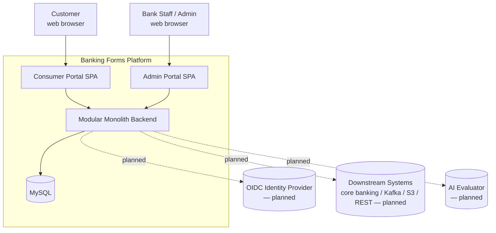
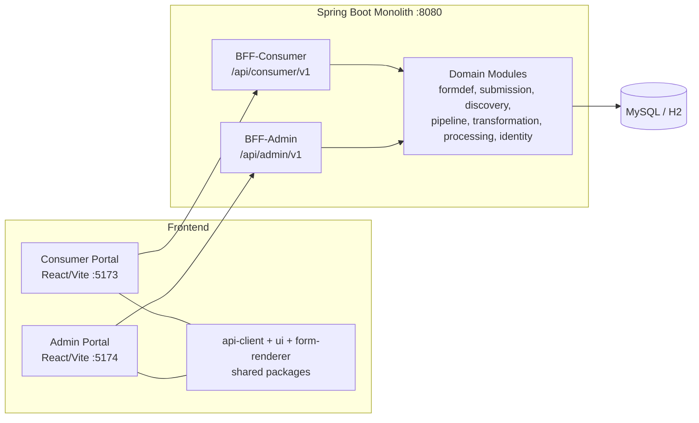
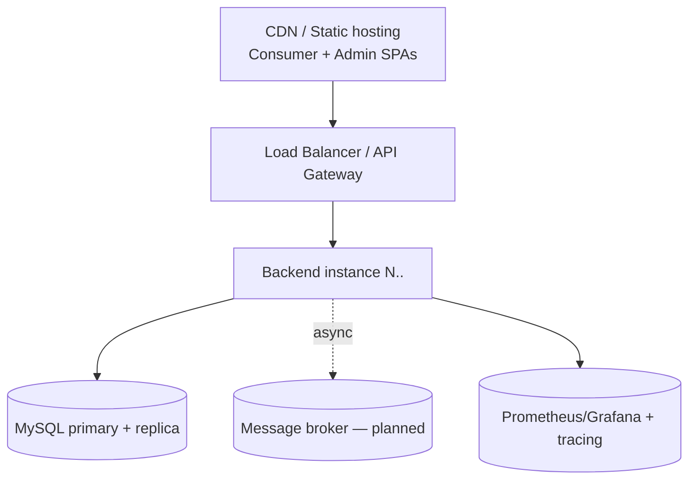

# Solution Architecture — Banking Forms Platform

**Audience:** Solution Architect, Enterprise Architect, Technical Lead
**Purpose:** The architecture view of the platform — context, containers, components, key decisions (ADRs), non-functional requirements, security/data/integration architecture, deployment topology, and the evolution roadmap.

> Companion documents: [`TECHNICAL_GUIDE.md`](TECHNICAL_GUIDE.md) (component detail for devs), [`PROJECT_MANAGEMENT.md`](PROJECT_MANAGEMENT.md) (delivery plan), [`ARCHITECTURE.md`](ARCHITECTURE.md) (original full design/source of truth).

---

## 1. Solution Overview

A **multi-tenant banking support platform** that lets banks author dynamic forms, lets customers discover and complete them, runs an automated processing pipeline (validation → PII scrubbing → downstream dispatch), and gives back-office staff a review workspace. Delivered as a **Spring Boot modular monolith** with **Backend-for-Frontend** APIs and two **React SPAs** (consumer + admin).

**Architecture goals**
- Fast form authoring/change without code (schema-driven).
- Strict tenant isolation and PII handling suitable for banking.
- A monolith that is *modularized for a future extraction to services* (clear module seams, no circular deps).
- A processing pipeline that starts synchronous but is designed to become event-driven/async.

---

## 2. C4 — Level 1: System Context

**Actors:** customers (fill/track applications), bank staff (author forms, review submissions). **External (planned):** OIDC IdP, downstream banking systems, AI evaluators.

---

## 3. C4 — Level 2: Container View

| Container | Tech | Responsibility |
|-----------|------|----------------|
| Consumer Portal | React/TS/Vite | Discovery, form filling, submission, application tracking |
| Admin Portal | React/TS/Vite | Form authoring, submission review, pipeline visibility |
| Shared FE packages | TS | Typed API client, design system, dynamic renderer |
| BFF-Consumer / BFF-Admin | Spring Web | Audience-specific REST facades, request context, DTO shaping |
| Domain modules | Spring/JPA | Business logic per bounded context |
| Database | MySQL 8 (H2 locally) | Persistence, Flyway-managed schema |

---

## 4. C4 — Level 3: Component View (Backend)

Bounded contexts (modules), each layered `domain → application → infrastructure`:

| Module | Bounded context | Core responsibility |
|--------|-----------------|---------------------|
| `module-identity` | Identity | Tenants, users, roles |
| `module-form-definition` | Form Authoring | Templates, versioning, schema composition |
| `module-form-import` | Form Import | Multi-source (PDF/CSV/XLS/HTML/URL/image) → draft form via pluggable, DB-configured extractors + human review |
| `module-service-integration` | External/AI Adapters | Ollama vision form-import provider (+ future AI-evaluate adapter) |
| `module-submission` | Submissions | Drafts, dual-strategy storage, validation, audit |
| `module-discovery` | Discovery | Triage rules, recommendation, prefill |
| `module-pipeline` | Processing | Orchestrate validate/scrub/downstream |
| `module-transformation` | Data Protection | PII scrubbing/tokenization |
| `module-processing` | Case Review | Manual review state machine |
| `module-observability` | Ops | Metrics/tracing |
| `module-notification / -downstream / -analytics` | (planned) | Notifications, connectors, analytics |

Detailed class-level breakdown: see [`TECHNICAL_GUIDE.md` §5–9](TECHNICAL_GUIDE.md).

---

## 5. Architecture Principles & Patterns

1. **Modular monolith** — single deployable, module boundaries as future service seams; no circular dependencies; cross-module access only via a module's public `application` service.
2. **Backend-for-Frontend** — separate consumer/admin facades so each UI gets a tailored, minimal contract and independent authz surface.
3. **Schema-driven forms** — forms are versioned JSON schemas; UI renders and validates dynamically; no deploy needed to change a form.
4. **Dual persistence strategy** — per-form `JSON_BLOB` (agility) vs `KEY_VALUE` (indexing/encryption for regulated data).
5. **Composition over duplication** — reusable building-block forms embedded via `embedded_form`, inlined by `FormSchemaComposer`.
6. **Explicit state machines** — submission lifecycle and review workflow are guarded transitions with an append-only audit trail.
7. **Fail-safe pipeline** — pipeline failures never fail the user's submit; they revert to `SUBMITTED` and are recorded for retry/review.
8. **Idempotency** — submit accepts an `Idempotency-Key`; unique per tenant.
9. **Pluggable, data-driven providers** — form extraction is a stable SPI (`FormExtractor`) selected from a DB registry (`form_import_provider`) by source type + priority; providers (incl. AI/vision) are added as beans + config rows, never by editing core logic.
10. **Human-in-the-loop AI** — extraction (incl. AI/vision) always produces a *proposal* that an admin reviews/edits/accepts before a draft form is created; nothing auto-publishes.

---

## 6. Architecture Decision Records (summary)

| ID | Decision | Rationale | Trade-off / Consequence |
|----|----------|-----------|--------------------------|
| ADR-1 | Modular monolith (not microservices) | Faster delivery, one DB, simpler ops for current scale; keep module seams | Must enforce boundaries by discipline; extraction later requires work |
| ADR-2 | BFF per audience | Tailored contracts, independent authz | Two API surfaces to maintain |
| ADR-3 | Versioned JSON form schemas | No-code/low-friction form change; auditability | Schema validation + composition complexity |
| ADR-4 | Dual section storage (JSON_BLOB / KEY_VALUE) | Balance agility vs field-level indexing/encryption | Two storage code paths; routing abstraction |
| ADR-5 | Synchronous pipeline now, event/outbox later | Simplicity first; correctness before scale | Submit latency includes pipeline; async migration pending (outbox table already present) |
| ADR-6 | UUID `BINARY(16)` keys | Tenant-safe, non-guessable, merge-friendly | Slightly less human-readable |
| ADR-7 | Dev headers (`X-Tenant-Id`/`X-Dev-User-Id`) pending OIDC | Unblock development | Must be replaced by OIDC before production (`SecurityConfig` ready) |
| ADR-8 | springdoc grouped OpenAPI | Self-documenting consumer/admin APIs | Keep annotations current |
| ADR-9 | Configurable, DB-driven form-import providers (SPI + `form_import_provider` registry) instead of hard-coded source enums | Add sources/providers (PDF/CSV/XLS/HTML/image/AI) without code changes; per-tenant/ops tuning via priority + `config_json` | Router/registry indirection; must guard "seeded but no bean available" |
| ADR-10 | Local Ollama vision (`llava`) for the image source; in-JVM parsers default; hosted-LLM seam disabled by default | On-device inference (no data egress), zero-setup default path, pluggable to hosted LLMs later | Ollama is an external runtime (Docker), CPU inference is slow; image downscale + generous timeouts needed |
| ADR-11 | Extraction output is a reviewed proposal, never auto-published | Safety/quality gate for AI-generated schemas; auditable | Extra admin step before a form goes live |

---

## 7. Data Architecture

- **Multi-tenancy:** shared-schema, tenant-scoped rows (`tenant_id` on all business tables); every query/service is tenant-filtered. (Row-level isolation; DB-per-tenant is a future option.)
- **Form model:** `form_definition` 1:N `form_version` (`DRAFT`/`PUBLISHED`/`DEPRECATED`); publishing auto-deprecates the prior published version.
- **Submission model:** `submission` → `submission_section` → `submission_field_value` (KEY_VALUE) or JSON blob (JSON_BLOB); `submission_event` append-only audit; `pipeline_execution` + `submission_sanitized_payload` for processing.
- **Form-import model:** `form_import_job` (source type, provider code, source hash for dedup, extracted/mapped JSON, lifecycle status) + `form_import_provider` (configurable extractor registry: code, source type, enabled, priority, `config_json`).
- **Migrations:** Flyway `V1`–`V11` (schema + seed + sample data + draft resume progress + form-import job/provider). See [`ARCHITECTURE.md` §5](ARCHITECTURE.md) and [`TECHNICAL_GUIDE.md` §7](TECHNICAL_GUIDE.md).
- **Encryption:** field-level encryption is enabled by the KEY_VALUE path (`is_encrypted` per field) + PII registry; at-rest DB encryption is a deployment concern.

---

## 8. Integration Architecture

| Integration | Status | Approach |
|-------------|--------|----------|
| Identity (OIDC) | Planned | `SecurityConfig` = OAuth2 resource server (JWT); replace dev headers |
| Form import — in-JVM extractors (PDF/CSV/XLS/HTML/URL) | ✅ Implemented | `FormExtractor` SPI beans in `module-form-import` (PDFBox/POI/jsoup), selected via `form_import_provider` registry |
| Form import — AI/vision (image) | 🟡 Local (Ollama) | `OllamaVisionFormExtractor` in `module-service-integration` calls local Ollama (`llava`); hosted-LLM seam (`llm-vision`) disabled pending provider |
| Downstream (core banking / Kafka / S3 / REST) | Planned | Connector interface in `module-downstream`, invoked by pipeline DOWNSTREAM step; `outbox_event` table for reliable async |
| AI evaluator (pipeline) | Planned | Adapter interface (`module-service-integration`), pipeline `AI_EVALUATE` step |
| Notifications | Planned | `module-notification`, triggered by events |
| Analytics | Planned | `module-analytics` export from sanitized payloads |

**Eventing:** an `outbox_event` table exists; the current pipeline is synchronous. Migration path is outbox → message broker → async step workers (event catalog in [`ARCHITECTURE.md` §8](ARCHITECTURE.md)).

---

## 9. Security Architecture

- **AuthN:** OIDC/JWT (planned, `SecurityConfig`); `local` profile permits `/api/**` for dev (`LocalSecurityConfig`).
- **AuthZ:** role-based; BFF separation limits admin surface; per-audience contracts.
- **Tenant isolation:** mandatory `X-Tenant-Id`; tenant-scoped repositories.
- **PII:** `module-transformation` scrubs/tokenizes sensitive fields into a sanitized payload before downstream/AI; KEY_VALUE enables field-level encryption; structured logging must exclude PII.
- **Auditability:** append-only `submission_event` timeline with actor + transitions.
- **Idempotency & input validation:** Bean Validation on request DTOs; server-side schema validation on every save/submit (never trust the client).

---

## 10. Non-Functional Requirements

| NFR | Target / Approach |
|-----|-------------------|
| **Scalability** | Stateless backend → horizontal scale; DB indexed on tenant/status/queue; async pipeline migration for throughput |
| **Availability** | Fail-safe pipeline (no submit failure); idempotent submit; health via `/actuator/health` |
| **Performance** | JSON_BLOB fast path for common forms; KEY_VALUE indexes for query; query-by-tenant indexes |
| **Security/Compliance** | Tenant isolation, PII scrubbing, field-level encryption, audit trail |
| **Observability** | Micrometer metrics, tracing, structured logs (Phase 5); pipeline execution records |
| **Maintainability** | Modular boundaries, typed shared API client, single schema source, tests |
| **Portability** | H2 (MySQL mode) locally, MySQL in prod; profile-based config |

---

## 11. Deployment & Runtime Topology

**Current (dev):** single Spring Boot process (`:8080`, `local` profile, in-memory H2, Flyway on boot); two Vite dev servers proxying `/api`.

**Target (prod, indicative):**

- SPAs served as static assets; backend behind gateway; MySQL managed with replicas; broker for async pipeline; Prometheus/Grafana + tracing for ops. Config via env/profiles (`mysql` profile shown in README).

---

## 12. Current State vs Roadmap

| Capability | State |
|-----------|-------|
| Foundation (monolith, DB, BFFs, FE scaffold, security scaffold) | ✅ Implemented (dev security via headers) |
| Form authoring APIs + versioning + publish | ✅ Implemented |
| Admin form builder (JSON editor) | ✅ Implemented (⚠️ visual drag-drop builder pending) |
| Dynamic renderer + section-wise submission + drafts + submit | ✅ Implemented |
| Consumer application lifecycle (list/resume/status) | ✅ Implemented |
| Discovery/triage + prefill | ✅ Implemented |
| Automated pipeline (validate → PII scrub → downstream) | ✅ Implemented (downstream = placeholder dispatch) |
| Manual review workflow + audit timeline + pipeline report | ✅ Implemented |
| Form import (multi-source, configurable providers, human-in-the-loop) | ✅ Implemented (PDF/CSV/XLS/HTML/URL in-JVM; image via local Ollama vision) |
| OIDC auth | ⏳ Planned |
| Real downstream connectors / eventing (outbox→broker) | ⏳ Planned |
| AI evaluator, service-integration adapters | ⏳ Planned |
| Notifications, analytics export | ⏳ Planned |
| Observability dashboards, load/security testing | ⏳ Planned |

*(Delivery mapping in [`PROJECT_MANAGEMENT.md`](PROJECT_MANAGEMENT.md).)*

---

## 13. Key Risks & Technical Debt

| Risk / Debt | Impact | Mitigation |
|-------------|--------|-----------|
| Dev-header auth still in place | Not production-safe | Implement OIDC (`SecurityConfig` ready) before any real deployment |
| Synchronous pipeline | Submit latency, no retry at scale | Move to outbox + async workers |
| Visual form builder is a stub | Admins must edit raw JSON | Build drag-drop builder (`FE-PKG-BUILDER`) |
| Downstream/AI/notifications are placeholders | No external side-effects yet | Implement connectors behind existing interfaces |
| Single shared DB | Blast radius / tenant scale ceiling | Read replicas now; DB-per-tenant option later |
